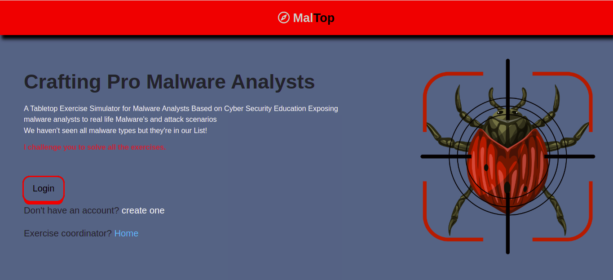

# MalTop
 A Tabletop Exercise Simulator for Malware Analysts Based on Cybersecurity Education

### Live App <a href="https://maltop.herokuapp.com/"> View Here </a>

## Projects Home page

## Dependencies
1. [junit-jupiter-api] 'org.junit.jupiter:junit-jupiter-api:5.8.2'
2. [junit-jupiter-engine] 'org.junit.jupiter:junit-jupiter-engine:5.8.2'
3. [spark-core] 'com.sparkjava:spark-core:2.9.3'
4. [slf4j-simple] 'org.slf4j:slf4j-simple:1.7.32'
5. [gson] 'com.google.code.gson:gson:2.8.9'
6. [sql2o]  group: 'org.sql2o', name: 'sql2o', version: '1.5.4'
7. [postgresql] group: 'org.postgresql', name: 'postgresql', version: '42.2.2'    

## Setup/Installation

1.edit all postgresql username, password and database instances

2.run psql < create.sql in the project root to create the local database

3.gradle run to compile and host the application [you can also use maven]

4.[optional] mvn heroku:deploy (to deploy to heroku)

## Technologies Used
* Java
* Spark
* Handlebars
* PostgreSQL
* Gradle
* Maven
* Bootstrap
* Fontawesome
* Heroku

## Contributions
If you'd like to contribute.
- Fork the repo
- Create a new branch (git checkout -b feature)
- Make the appropriate changes in the files
- Add changes to reflect the changes made
- Commit your changes (git commit -am 'Improve/Add feature')
- Push to the branch (git push origin feature)
- Create a Pull Request
  [Make sure your code is properly commented]
  - If you find a bug, kindly open an issue <a href="https://github.com/Karanu63/MalTop/issues/new">Here</a> .
  - If you'd like to request a new function, feel free to do so by opening an issue <a href="https://github.com/Karanu63/MalTop/issues/new">Here</a>.

## Known Bugs
N/A

## <a href="https://github.com/Karanu63/MalTop/blob/main/LICENSE">Licence</a>
MIT License

# Copyright (c) 2021 MalTop